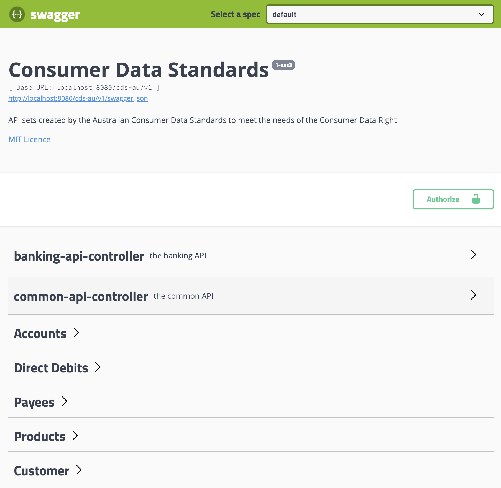
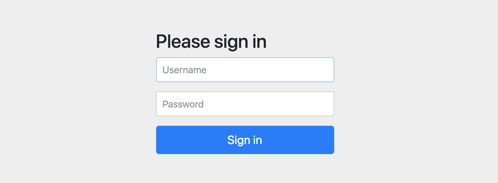

# Open Bank API demo

This is project is to demonstrate [OpenAPI 3.0](https://github.com/OAI/OpenAPI-Specification/blob/master/versions/3.0.0.md) and [OAuth2](https://alexbilbie.com/guide-to-oauth-2-grants/) technology.

[cds.yaml](https://github.com/fyang1024/open-bank-api/blob/master/cds.yaml) is the API spec in OpenAPI 3.0 format. It is converted from [the doc in OpenAPI 2.0 format](https://raw.githubusercontent.com/ConsumerDataStandardsAustralia/standards/master/swagger-gen/cds_full.json). 

The spec exposes a set of banking related APIs and a common customer API. I have added OAuth2 security scheme onto it.

The `server` folder contains 2 projects:
* `auth` is the OAuth2 server
* `resource` is the Resource server (API end points provider)

Both projects are implemented with Spring boot 2 framework.

I recorded a [YouTube video](https://www.youtube.com/watch?v=I7Yisb555fs) to demo them working together.

I have deployed the them on Heroku. You can play it here https://openbank-resource.herokuapp.com
The username / password are user / pass respectively when you authorize the swagger ui to access the APIs  

### Before you start

1. Install [JDK 8](https://www.oracle.com/technetwork/java/javase/downloads/jdk8-downloads-2133151.html)

2. Install [Maven 3](https://maven.apache.org/download.cgi)

### Get started

1. Open a terminal and navigate to `server/auth` folder and run `mvn spring-boot:run` to start OAuth2 server at http://localhost:9090
2. Open another terminal navigate to `server/resource` folder and run `mvn spring-boot:run` to start Resource server at http://localhost:8080
3. Open a browser and navigate to http://localost:8080 and you should see the swagger UI play with APIs

4. Click "Authorize" button and a popup will show

5. Click "Authorize" on the popup, a new tab will be opened for user to login

6. Type "user" and "pass" as username / password and Click Sign in, you'll be redirected to the API screen
7. You are authorised to get protected resource from the API now.
 
